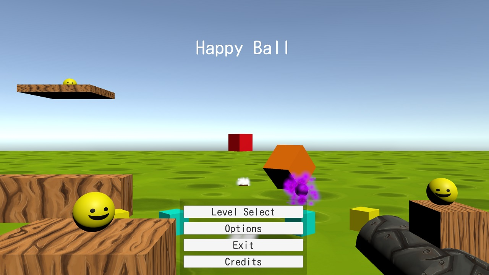
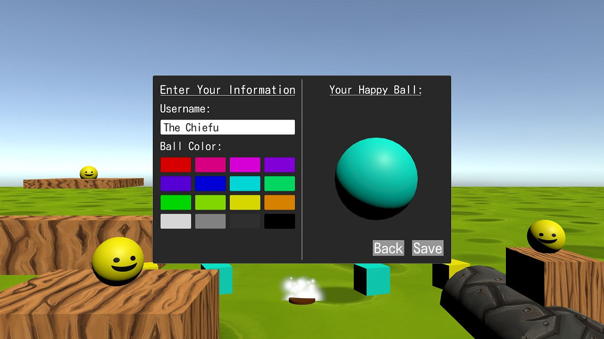
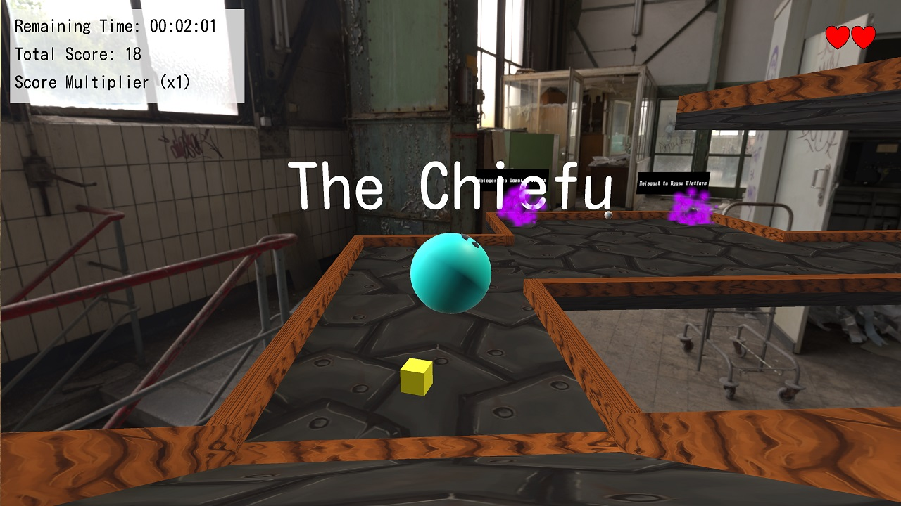

# Happy Ball
Open Source Unity Game where player can solve short puzzles as moving ball.
This is a challenge project to see if I can create a useable game within my URI winter break of 2020-2021.
The premise of the game is that the user solves simple puzzles using a moving ball called the "Happy Ball". 

The premise of this game is to collect as many coins as you can and beat the level as fast as possible. Some levels require you to press all the switches so make sure to check every corner.

Download Windows Build Zip: [Windows 10 32/64 Bit](https://drive.google.com/file/d/1t5cgN_3mWuCpiy2xo8tcX6uiUbdBe-Xq/view?usp=sharing)

**Screenshots:**

**Development:**
In regards to development the folder structure is setup as followed. All relevant Unity Engine assets are in the "Assets" folder. Then the folder structure is:

 - **_Backend**: Which contains the font and icon for the game's build options
 - **_Prefabs**: Which contain the level building blocks in which levels are constructed on. When making a new level just drag the "_Setup" prefab to ensure the game's backend *GameManager* is loaded on scene play, place a "LevelManager" prefab to setup your specific level's settings, and finally a "Happy_Ball" prefab for the player then you should be good to go.
 - **Audio**: Contains just the music and sfx of the game
 - **Gizmos**: Which just holds icons for Unity to use on custom scripts
 - **Materials**: Which holds the basic color materials and texture files.
 - **MultilingualObjects**: Which hold the text for English and 日本語 text. So that when you use a *TextMeshPro* and a *MultilanguageSO*you can just put in the Object and the text should change depending on your selected language.
- **Scenes**: Which hold the Unity Scene files
- **Scripts**: Which hold all the scripts in the project
- **TextMeshPro**: Auto-Generated by Unity
- **UI**: Which hold all the UI textures
 
**Other:**
- To ensure there are no legal issues there are no copyrighted assets in this project to keep it open source.
- This project also uses the [MIT License](https://choosealicense.com/licenses/mit/)
- This project is made using: [Unity 2020.2.0f1](https://unity.com/releases/2020-1)
